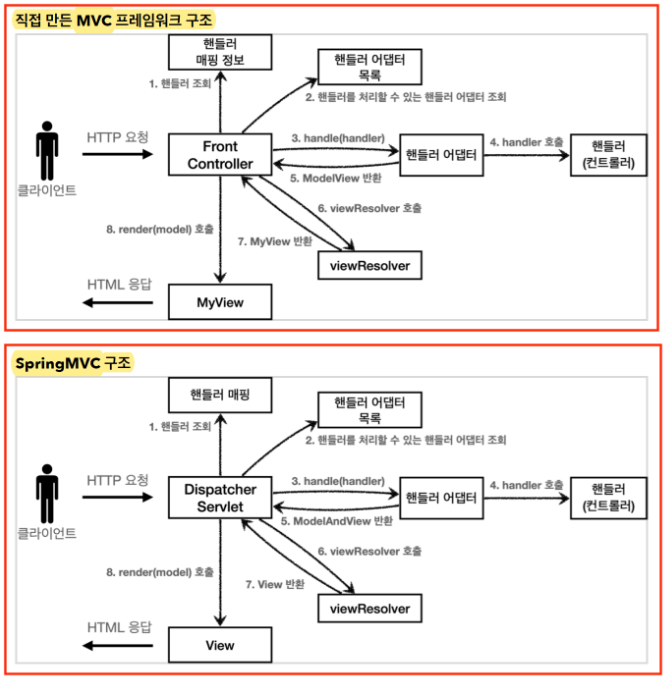

# SelfMade Spring MVC
## 예제코드를 이용한 기능개발
1. 등록멤버리스트 확인
2. 신규멤버 등록
3. 신규멤버 등록 확인

## 디렉토리 설명
### 1. /src/main/java/hello/servlet/basic
* 서블릿 구현클래스들을 직접 사용해봤습니다.
* HttpServletRequest, HttpServletResponse 의 구성과 활용에 대해서 예제소스코드를 작성했습니다.
### 2. /src/main/java/hello/servlet/domain
* 예제 소스코드에서 사용할 엔터티와 리포지토리를 작성했습니다.
### 3. /src/main/java/hello/servlet/web/frontcontroller
* frontcontroller 패턴을 이용해서 서블릿의 중복을 최소화했습니다.
* View, ModelAndView, Controller를 분리하여 개발했습니다.
### 4. /src/main/java/hello/servlet/web/servlet
* 서블릿을 이용해서 html을 가장 원시적인 방법으로 사용자에게 전달했습니다.
### 5. /src/main/java/hello/servlet/web/servletmvc
* JSP를 활용하여 html을 사용자에게 전달했습니다.
### 6. /src/main/java/hello/servlet/web/springmvc
* Annotation을 활용하여 스프링스럽게 개발을 진행했습니다.
* 위에서 직접 구현했었던 작업들을 전부 스프링프레임워크를 이용하여 개발했습니다.

## 기초 용어 및 구현클래스 설명
* FrontController --> DispatcherServlet
* handlerMappingMap --> HandlerMapping
* MyHandlerAdapyer --> HandlerAdapter
* ModelView --> ModelAndView
* viewResolver --> viewResolver
* MyView --> View

## 구현 아키텍처 이미지
